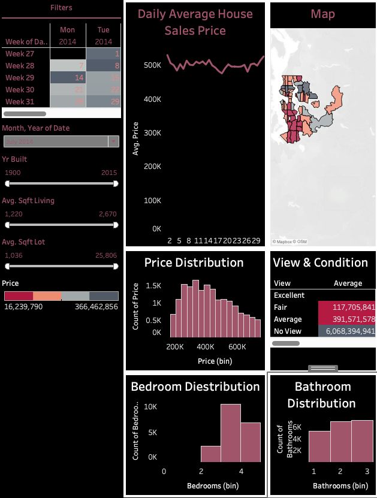

# House Data Dashboard (Tableau)

##  Project Overview
This Tableau dashboard analyzes house sales data to identify trends in pricing, location, and property features.

## Key Insights
- Price distribution by location
- Relationship between house size and price
- Sales trends over time
- Comparison of property features

## Tools Used
- Tableau
- Excel
- Data Visualization

## Dashboard Preview

## Files Included
- House Data Dashboard.twb
- HouseData.xlsx
- Dashboard screenshots (.png files)

##  Author
Vinit Bhalerao